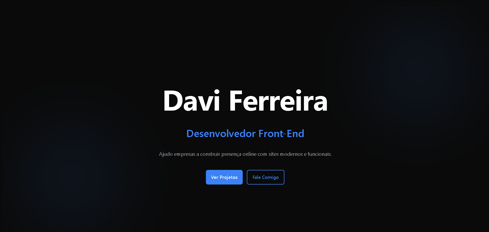

# 💻 Portfólio - Davi Ferreira

Este é o meu portfólio como desenvolvedor front-end, onde apresento meus projetos, habilidades e formas de contato.

---

## 🚀 Tecnologias utilizadas

- HTML5
- CSS3
- JavaScript

---

## 🎯 Objetivo

O objetivo deste projeto é demonstrar minhas habilidades em desenvolvimento web, criando interfaces modernas, responsivas e funcionais.

---

## 📂 Estrutura do projeto
portfolio/
│
├── index.html
├── README.md
└── src/
├── styles/
├── assets/

---

## 📸 Preview

---

## 🌐 Acesse o projeto

🔗 https://dferreiraz.github.io/portfolio/

---

## 📞 Contato

- Instagram: dferreira.dev  
- Email: davi2580vege@gmail.com  

---

## ✨ Funcionalidades

- Seção de apresentação (Hero)
- Sobre mim
- Projetos
- Contato direto

---

## 📌 Status

🚧 Em desenvolvimento / Atualizações constantes